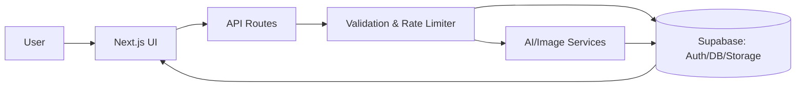

<div align="center">

<h1 style="display: inline-flex; align-items: center; gap: 10px; margin: 0;">
  
  <span>GenHive AI</span>
</h1>

AI-assisted content and image tooling for modern creators — fast, secure, and elegant.

[](https://www.typescriptlang.org/)
[](https://nextjs.org/)
[](https://supabase.com/)

<br />
<a href="#quick-start"><b>Quick Start</b></a> •
<a href="#features"><b>Features</b></a> •
<a href="#file-structure"><b>File Structure</b></a> •
<a href="#api"><b>API</b></a> •
<a href="#security"><b>Security</b></a>

</div>

> GenHive AI is a production-grade Next.js platform for AI-assisted content and image workflows. It pairs a refined UI with a robust API layer and secure Supabase backing to deliver intuitive tools with real-world guardrails.

Note: The links above navigate to sections within this README—no external pages required.

### Highlights
- ✨ Modern stack: Next.js 14 (App Router), React, TypeScript
- 🎨 Clean UI: Tailwind CSS + shadcn/ui, Markdown-first rendering
- 🔒 Secure backend: Supabase with RLS, validated APIs, rate limits
- 🧰 Practical tools: Articles, titles, resume review, image gen/edit
- 📊 Ops visibility: Usage limits, activity history, copy/export utilities

### Why GenHive AI
- ⚡ Speed to value: Minimal setup and sensible defaults
- 🧩 Extensible: Clear patterns for adding new tools/endpoints
- 🛡️ Safe by default: Validation, rate limiting, and RLS data access

### Tech Stack
- Next.js, React, TypeScript
- Tailwind CSS, shadcn/ui, lucide-react
- Supabase (Auth, Postgres, Storage)
- react-markdown, remark-gfm, rehype-highlight

---

## Table of Contents

- [Quick Start](#quick-start)
- [Features](#features)
- [File Structure & Architecture](#file-structure--architecture)
- [Design Principles](#design-principles)
- [Detailed Setup Guide](#detailed-setup-guide)
- [Usage](#usage)
- [Tools](#tools)
- [API](#api)
- [Data Model](#data-model)
- [Security](#security)
- [Contributing](#contributing)
- [Troubleshooting & FAQ](#troubleshooting--faq)
- [Roadmap](#roadmap)
 - [Deployment](#deployment)
 - [Performance & Accessibility](#performance--accessibility)

## Quick Start

1) Clone and install
```
git clone <this-repo>
cd <repo-folder>
npm install
```

2) Configure environment
Create `.env.local` in the project root:
```
NEXT_PUBLIC_SUPABASE_URL=...
NEXT_PUBLIC_SUPABASE_ANON_KEY=...
SUPABASE_SERVICE_ROLE_KEY=...
```

3) Run the app
```
npm run dev
```

Open the app in your browser (default `http://localhost:3000`).

## File Structure

```
.
├─ public/
│  ├─ images/
│  │  ├─ ai_gen_img_1.png
│  │  ├─ ai_gen_img_2.png
│  │  └─ ai_gen_img_3.png
│  ├─ logo.svg
│  └─ ...
├─ src/
│  ├─ app/
│  │  ├─ ai/
│  │  │  ├─ writearticle/page.tsx       # Article UI
│  │  │  ├─ blogtitles/page.tsx         # Titles UI
│  │  │  ├─ reviewresume/page.tsx       # Resume review UI
│  │  │  ├─ generateimage/page.tsx      # Image generation UI
│  │  │  ├─ removebackground/page.tsx   # Background removal UI
│  │  │  └─ removeobject/page.tsx       # Object removal UI
│  │  ├─ api/
│  │  │  ├─ articles/route.ts           # POST article
│  │  │  ├─ blogtitles/route.ts         # POST titles
│  │  │  ├─ reviewresume/route.ts       # POST resume analysis
│  │  │  ├─ generateimage/route.ts      # POST image generation
│  │  │  ├─ removebackground/route.ts   # POST background removal
│  │  │  └─ removeobject/route.ts       # POST object removal
│  │  └─ layout.tsx / page.tsx          # App layout and landing
│  ├─ components/
│  │  ├─ common/
│  │  │  ├─ ContentViewer.tsx           # Markdown viewer with highlighting
│  │  │  ├─ CreationItem.tsx            # Activity/history item
│  │  │  └─ UsageDisplay.tsx            # Usage meter
│  │  ├─ dashboard/
│  │  │  ├─ ContentCard.tsx
│  │  │  ├─ ContentSection.tsx
│  │  │  ├─ EmptyState.tsx
│  │  │  ├─ RecentActivitySidebar.tsx
│  │  │  └─ StatsCards.tsx
│  │  ├─ Landingpage/
│  │  │  ├─ Hero.tsx • Navbar.tsx • Sidebar.tsx • AITools.tsx
│  │  │  └─ Footer.tsx • Testimonial.tsx • ThemeToggle.tsx • Logo.tsx
│  │  └─ ui/                          # shadcn/ui primitives
│  │     ├─ alert.tsx • badge.tsx • button.tsx • dialog.tsx
│  │     ├─ input.tsx • progress.tsx • sheet.tsx • switch.tsx
│  │     └─ textarea.tsx • toast.tsx • toaster.tsx
│  ├─ lib/
│  │  ├─ database/
│  │  │  ├─ db.ts                      # Supabase client
│  │  │  ├─ subscription-manager.ts
│  │  │  └─ user-sync.ts • auto-sync.ts • supabase-utils.ts
│  │  ├─ middleware/
│  │  │  ├─ api-wrapper.ts • rate-limiter.ts • security.ts
│  │  ├─ hooks/                        # useArticleGenerator, useDashboard, etc.
│  │  ├─ validation/schemas.ts         # Zod schemas
│  │  ├─ services/                     # user-service, server/client helpers
│  │  ├─ config/                       # usage-limits, pagination
│  │  └─ utils.ts • usage-tracker.ts
│  └─ app/globals.css • tailwind config
├─ patches/
│  └─ pdf-parse+1.1.1.patch          # PDF parsing fix for serverless deployment
├─ README.md
├─ .gitignore • tsconfig.json • package.json • next.config.ts
└─ supabase-optimized-schema.sql        # Optional: reference schema
```

## Architecture

Data flow:
1) User action in UI → 2) Client calls API → 3) Validate + check limits → 4) Execute AI/image op → 5) Persist/return → 6) Render Markdown/images.

Cross-cutting concerns:
- Validation: `src/lib/validation/schemas.ts`
- Security: `src/lib/middleware/security.ts`
- Rate limiting: `src/lib/middleware/rate-limiter.ts`
- Database: `src/lib/database/*.ts`

Diagram:


## Design Principles

- Clarity first, responsive, accessible
- Safety & limits baked in
- Separation of concerns across UI, API, and services

UI system:
- Tailwind + shadcn/ui, custom `prose` styles for Markdown
- Markdown via `react-markdown` + `remark-gfm`, optional `rehype-highlight`

Component conventions:
- Presentational in `components/ui` and `components/common`; feature components near routes
- Prefer composition; keep components focused

Error & state management:
- Toasts for feedback; hooks (e.g., `useArticleGenerator`) encapsulate side effects

## Features

Write Article
- Generate Markdown long-form with headings/lists/quotes/code
- Hash `#` title line renders as H1; viewer supports GFM and highlighting

Blog Titles
- SEO-friendly suggestions from a keyword; one-click copy and activity save

Resume Review
- Analyze strengths, gaps, missing keywords; Markdown summary

Image Generation
- Prompt-based generation; sizes/styles; preview and save

Background/Object Removal
- Upload and process images; download results; tracked in activity

Shared UX
- Consistent toasts, loading/error states, content viewer, usage meter

Screenshots (placeholders)
- Article Writer: `public/images/ai_gen_img_1.png`
- Image Generation: `public/images/ai_gen_img_2.png`
- Dashboard: `public/images/ai_gen_img_3.png`

## Detailed Setup Guide

1) Prerequisites
- Node.js LTS installed
- Supabase project with access to Project URL and keys

2) Environment Variables (`.env.local`)
Create a file named `.env.local` in the project root with:
```
NEXT_PUBLIC_SUPABASE_URL=your-supabase-project-url
NEXT_PUBLIC_SUPABASE_ANON_KEY=your-supabase-anon-key
SUPABASE_SERVICE_ROLE_KEY=your-supabase-service-role-key
```
Descriptions:
- `NEXT_PUBLIC_SUPABASE_URL`: Public URL for your Supabase project (used by client and server).
- `NEXT_PUBLIC_SUPABASE_ANON_KEY`: Public anon key (used by client and server).
- `SUPABASE_SERVICE_ROLE_KEY`: Service role key for privileged server operations. Do not expose to the client.

Optional: Clerk (only if using Clerk for authentication)
```
NEXT_PUBLIC_CLERK_PUBLISHABLE_KEY=your-clerk-publishable-key
CLERK_SECRET_KEY=your-clerk-secret-key
CLERK_SIGN_IN_URL=/sign-in
CLERK_SIGN_UP_URL=/sign-up
CLERK_AFTER_SIGN_IN_URL=/
CLERK_AFTER_SIGN_UP_URL=/
```
Descriptions:
- `NEXT_PUBLIC_CLERK_PUBLISHABLE_KEY`: Public key used by the frontend to initialize Clerk.
- `CLERK_SECRET_KEY`: Server-side secret for Clerk APIs/webhooks (never exposed to client).
- `CLERK_SIGN_IN_URL`, `CLERK_SIGN_UP_URL`: Optional custom routes for auth pages.
- `CLERK_AFTER_SIGN_IN_URL`, `CLERK_AFTER_SIGN_UP_URL`: Optional post-auth redirect routes.

3) (Optional) Import Database Schema
- Open Supabase SQL editor, paste contents of `supabase-optimized-schema.sql`, and run.
- This creates the recommended tables, indexes, and RLS policies.

4) Install & Run Locally
```
npm install
npm run dev
```
Open `http://localhost:3000`.

Production build & start
```
npm run build
npm run start
```
The app will start on the configured port (default 3000).

5) Verify Core Flows
- Sign up/in → profile creation
- Use AI tools (Write Article, Blog Titles, Resume Review, Image tools)
- Check dashboard activity and usage updates

6) Deployment (Vercel recommended)
- Connect repo → set env vars in Vercel → deploy
- Ensure production Supabase URL/keys are correct
- PDF parsing is automatically fixed for serverless deployment via patches

7) Troubleshooting
- Missing env: ensure `.env.local` is present and populated
- API errors: check server logs and network tab
- Data access issues: verify Supabase RLS policies
- PDF parsing errors: ensure `patches/pdf-parse+1.1.1.patch` is committed and `postinstall` script runs

## Detailed Setup Guide

1) Create a Supabase Project
- Go to `https://app.supabase.com`, create a project.
- Obtain the Project URL and Anon/Public Key.

2) Configure Environment Variables
- Create `.env.local` in the project root with:
```
NEXT_PUBLIC_SUPABASE_URL=your-project-url
NEXT_PUBLIC_SUPABASE_ANON_KEY=your-anon-key
SUPABASE_SERVICE_ROLE_KEY=your-service-role-key
```
- Do not expose the Service Role Key to the client; it is server-only.

3) Import the Database Schema (Optional but recommended)
- Open Supabase SQL editor and paste `supabase-optimized-schema.sql` from the repo.
- Execute to create tables, indexes, and RLS policies.

4) Run the App Locally
```
npm install
npm run dev
```
- Visit `http://localhost:3000`.

5) Verify Core Flows
- Sign up/sign in; ensure profile is created.
- Use AI tools (Write Article, Blog Titles, Resume Review, Image tools).
- Confirm results appear in dashboard activity and usage updates.

6) Deployment (Vercel Recommended)
- Connect your GitHub repo to Vercel
- Set all environment variables in Vercel dashboard
- Ensure production Supabase URL and keys are configured
- The `patches/` folder will automatically apply PDF parsing fixes during build
- Deploy and verify all API routes work in production

**Important**: The `patches/pdf-parse+1.1.1.patch` file fixes PDF parsing issues in serverless environments. This patch is automatically applied during deployment.

## Usage

Write Article
1) AI → Write Article → enter topic/constraints → generate → review/copy

Blog Titles
1) AI → Blog Titles → enter keyword → select/copy

Resume Review
1) AI → Review Resume → paste/upload → review → export summary

Image Tools
- Generate Image (prompt) • Remove Background/Object (upload → process)

Dashboard & Activity
- Review recent items, copy outputs, monitor usage quotas

## Tools

All built-in tools and where to use them:

- Write Article
  - UI: `src/app/ai/writearticle/page.tsx` (navigate: AI → Write Article)
  - API: `POST /api/articles` (`src/app/api/articles/route.ts`)
  - Output: Markdown article with headings, lists, quotes, and code

- Blog Titles
  - UI: `src/app/ai/blogtitles/page.tsx` (navigate: AI → Blog Titles)
  - API: `POST /api/blogtitles` (`src/app/api/blogtitles/route.ts`)
  - Output: Multiple SEO-friendly title suggestions

- Resume Review
  - UI: `src/app/ai/reviewresume/page.tsx` (navigate: AI → Review Resume)
  - API: `POST /api/reviewresume` (`src/app/api/reviewresume/route.ts`)
  - Output: Strengths, gaps, missing keywords, and a Markdown summary

- Generate Image
  - UI: `src/app/ai/generateimage/page.tsx` (navigate: AI → Generate Image)
  - API: `POST /api/generateimage` (`src/app/api/generateimage/route.ts`)
  - Output: Generated image URL(s) with metadata

- Remove Background
  - UI: `src/app/ai/removebackground/page.tsx` (navigate: AI → Remove Background)
  - API: `POST /api/removebackground` (`src/app/api/removebackground/route.ts`)
  - Output: Image with background removed

- Remove Object
  - UI: `src/app/ai/removeobject/page.tsx` (navigate: AI → Remove Object)
  - API: `POST /api/removeobject` (`src/app/api/removeobject/route.ts`)
  - Output: Image with selected object(s) removed

## API

Endpoints (App Router `src/app/api`)
- POST `/api/articles` — Generate article
- POST `/api/blogtitles` — Generate blog titles
- POST `/api/generateimage` — Generate image
- POST `/api/removebackground` — Remove background
- POST `/api/removeobject` — Remove object
- POST `/api/reviewresume` — Analyze resume text

Conventions
- Validation: `src/lib/validation/schemas.ts`
- Errors: `src/lib/errors/api-errors.ts`
- Middleware: `src/lib/middleware/*`

Example (Generate Article)
Request:
```json
{ "topic": "Email spam mitigation", "tone": "professional", "length": "long" }
```
Response:
```json
{ "id": "uuid", "content": "# Title...\n...", "created_at": "2025-09-09T10:00:00Z" }
```

Example (from the browser)
```ts
// POST /api/articles
const res = await fetch('/api/articles', {
  method: 'POST',
  headers: { 'Content-Type': 'application/json' },
  body: JSON.stringify({ topic: 'Email spam mitigation', tone: 'professional' })
});
const data = await res.json();
console.log(data.content); // markdown string
```

Example (from Node.js script)
```ts
import fetch from 'node-fetch';

async function main() {
  const res = await fetch('http://localhost:3000/api/blogtitles', {
    method: 'POST',
    headers: { 'Content-Type': 'application/json' },
    body: JSON.stringify({ keyword: 'Next.js AI' })
  });
  const data = await res.json();
  console.log(data.titles);
}

main();
```

Endpoint schemas (representative)
- Articles
  - Request: `{ topic: string; tone?: "casual"|"professional"|"friendly"; length?: "short"|"medium"|"long" }`
  - Response: `{ id: string; content: string; created_at: string }`
- Blog Titles
  - Request: `{ keyword: string; count?: number }`
  - Response: `{ titles: string[]; created_at: string }`
- Resume Review
  - Request: `{ resumeText: string; jobDescription?: string }`
  - Response: `{ strengths: string[]; gaps: string[]; missingKeywords: string[]; summary: string }`
- Generate Image
  - Request: `{ prompt: string; size?: "512x512"|"768x768"; style?: string }`
  - Response: `{ id: string; imageUrl: string; created_at: string }`
- Remove Background/Object
  - Request: multipart/form-data with image file (and mask for object removal)
  - Response: `{ id: string; imageUrl: string; created_at: string }`

Errors
- All endpoints return normalized errors with HTTP status codes and a JSON payload like `{ error: { code: string; message: string } }`.

## Data Model

Typical tables
- `profiles`: user profiles and plan info
- `activities`: records of generated content and actions
- `images`: generated/processed images metadata

See `supabase-optimized-schema.sql` for schema and RLS.

Activity record (illustrative):
```sql
id uuid primary key,
user_id uuid references auth.users,
action_type text,
input_params jsonb,
content text,
image_url text,
created_at timestamptz default now()
```
Indexes and performance
- Use btree indexes on `created_at`, `user_id`, and `action_type` to speed up dashboards and queries.
- Consider storage lifecycle rules for images to control costs.

## Security

- `.env.local` is Git-ignored (`.env*`)
- Supabase RLS for tenant isolation
- Rate limiter middleware
- Input validation; avoid raw HTML rendering

Recommendations
- Rotate and scope keys; use HTTPS and secure cookies
- Monitor rate limits and errors; sanitize user content

Security checklist
- [ ] `.env.local` excluded from Git (covered by `.env*` rule)
- [ ] RLS policies enforced for all user-accessible tables
- [ ] Rate limiter enabled on public endpoints
- [ ] Input validation (Zod) on all request payloads
- [ ] No unsanitized HTML rendering on client

## Contributing

Development
1) Fork/clone → 2) `.env.local` → 3) `npm install && npm run dev`

Guidelines
- Match code style and lint; clear names; small PRs
- Update this README when changing behavior or APIs

Code Review Checklist
- Descriptive PR title/summary
- Tests or manual validation steps
- Security/privacy considerations
- Updated docs and screenshots if relevant

Branching & releases
- Feature branches: `feat/<short-description>`
- Fix branches: `fix/<short-description>`
- Conventional commits recommended (e.g., `feat:`, `fix:`, `docs:`)

## Troubleshooting & FAQ

Common issues
- 401/403 from API: Check Supabase keys and RLS policies.
- Empty results: Verify rate limits and input validation errors in logs.
- Markdown not rendering: Ensure `react-markdown` and `remark-gfm` are installed and viewer is used.
- PDF parsing fails in production: Ensure `patches/pdf-parse+1.1.1.patch` is committed and `postinstall` script runs during deployment.

FAQ
- Q: Can I add a new AI tool? 
  A: Yes. Add a new page under `src/app/ai/<tool>/page.tsx`, an API route under `src/app/api/<tool>/route.ts`, extend validation schemas, and follow existing patterns.
- Q: Where are usage limits configured?
  A: See `src/lib/config/usage-limits.ts` and related middleware.
- Q: How do I change prose styles?
  A: Adjust Tailwind prose classes in viewers like `ContentViewer.tsx`.
- Q: Why does PDF parsing fail in Vercel but work locally?
  A: The `pdf-parse` library has debug mode issues in serverless environments. The included patch fixes this automatically.
- Q: Do I need to keep the patches folder?
  A: Yes! The `patches/` folder contains essential fixes for serverless deployment and must be committed to your repository.

## Roadmap
- Add more export formats (PDF/Docx)
- OAuth providers and workspace roles
- Advanced image editing (inpainting/outpainting)
- Improved analytics and usage insights


---

## Deployment

- **Recommended**: Vercel for Next.js hosting with automatic builds
- Configure environment variables in your hosting provider
- Ensure Supabase URL/keys set for the production environment
- **Important**: The `patches/pdf-parse+1.1.1.patch` file automatically fixes PDF parsing issues in serverless environments
- The `postinstall` script ensures patches are applied during deployment

## PDF Parsing Fix for Serverless Deployment

### The Problem
The `pdf-parse` library has a known issue in serverless environments (like Vercel) where it tries to access test files that don't exist, causing PDF parsing to fail with "failed to parse PDF" errors.

### The Solution
This project includes a patch (`patches/pdf-parse+1.1.1.patch`) that:
- Disables debug mode in `pdf-parse` to prevent filesystem access
- Ensures PDF parsing works in both development and production
- Is automatically applied during deployment via the `postinstall` script

### Files Involved
- `patches/pdf-parse+1.1.1.patch` - The patch file (must be committed)
- `package.json` - Contains `postinstall` script to apply patches
- `src/app/api/reviewresume/route.ts` - Updated with serverless-friendly PDF parsing

### Important Notes
- ✅ **Keep the `patches/` folder** - It's essential for production deployment
- ✅ **Commit the patch file** - It must be in your repository
- ✅ **The fix is automatic** - No manual intervention needed during deployment

## Performance & Accessibility

- Static optimization where possible; SSR for API-backed pages.
- Use `rehype-highlight` only when code blocks are present.
- Tailwind + shadcn/ui ensures accessible defaults; validate with lighthouse.
- Optimize images and leverage Next.js `Image` where used.

 

<div align="center">

<sub>Made with ✨, ❤️, and ☕ by <b>Pratik</b> · Powered by <b>Next.js</b> + <b>Supabase</b> · PRs welcome 🚀</sub>

</div>
