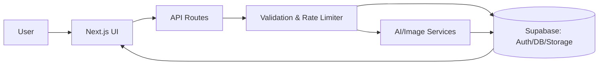

<div align="center">


# GenHive AI

AI-assisted content and image tooling for modern creators — fast, secure, and elegant.

[](https://www.typescriptlang.org/)
[](https://nextjs.org/)
[](https://supabase.com/)
[](LICENSE)

<br />
<a href="#quick-start"><b>Quick Start</b></a> •
<a href="#features"><b>Features</b></a> •
<a href="#file-structure--architecture"><b>Architecture</b></a> •
<a href="#api"><b>API</b></a> •
<a href="#security"><b>Security</b></a>

</div>

> GenHive AI is a production-grade Next.js platform for AI-assisted content and image workflows. It pairs a refined UI with a robust API layer and secure Supabase backing to deliver intuitive tools with real-world guardrails.

Note: The links above navigate to sections within this README—no external pages required.

### Highlights
- ✨ Modern stack: Next.js 14 (App Router), React, TypeScript
- 🎨 Clean UI: Tailwind CSS + shadcn/ui, Markdown-first rendering
- 🔒 Secure backend: Supabase with RLS, validated APIs, rate limits
- 🧰 Practical tools: Articles, titles, resume review, image gen/edit
- 📊 Ops visibility: Usage limits, activity history, copy/export utilities

### Why GenHive AI
- ⚡ Speed to value: Minimal setup and sensible defaults
- 🧩 Extensible: Clear patterns for adding new tools/endpoints
- 🛡️ Safe by default: Validation, rate limiting, and RLS data access

### Tech Stack
- Next.js, React, TypeScript
- Tailwind CSS, shadcn/ui, lucide-react
- Supabase (Auth, Postgres, Storage)
- react-markdown, remark-gfm, rehype-highlight

---

## Table of Contents

- [Quick Start](#quick-start)
- [Features](#features)
- [File Structure & Architecture](#file-structure--architecture)
- [Design Principles](#design-principles)
- [Setup](#setup)
- [Usage](#usage)
- [API](#api)
- [Data Model](#data-model)
- [Security](#security)
- [Contributing](#contributing)
- [Troubleshooting & FAQ](#troubleshooting--faq)
- [Roadmap](#roadmap)

## Quick Start

1) Clone and install
```
git clone <this-repo>
cd <repo-folder>
npm install
```

2) Configure environment
Create `.env.local` in the project root:
```
NEXT_PUBLIC_SUPABASE_URL=...
NEXT_PUBLIC_SUPABASE_ANON_KEY=...
SUPABASE_SERVICE_ROLE_KEY=...
```

3) Run the app
```
npm run dev
```

Open the app in your browser (default `http://localhost:3000`).

## File Structure & Architecture

```
src/
  app/
    ai/                  # Feature pages (article, titles, images, resume, etc.)
    api/                 # Serverless API endpoints
  components/            # UI components (common, dashboard, ui)
  lib/                   # Services, hooks, validation, utils
```

Key directories:
- `src/app/ai`: Feature routes (`writearticle`, `blogtitles`, `generateimage`, `removebackground`, `removeobject`, `reviewresume`).
- `src/app/api`: API routes for tools and user/account operations.
- `src/components/common`: Shared UI (`ContentViewer`, `CreationItem`, `UsageDisplay`).
- `src/lib`: Database, services (`user-service`), middleware (rate limiting, security), hooks, validation.

Data flow:
1) User action in UI → 2) Client calls API → 3) Validate + check limits → 4) Execute AI/image op → 5) Persist/return → 6) Render Markdown/images.

Cross-cutting concerns:
- Validation: `src/lib/validation/schemas.ts`
- Security: `src/lib/middleware/security.ts`
- Rate limiting: `src/lib/middleware/rate-limiter.ts`
- Database: `src/lib/database/*.ts`

Additional structure (selected files):
```
src/
  app/
    ai/
      writearticle/page.tsx        # Article UI
      blogtitles/page.tsx          # Titles UI
      reviewresume/page.tsx        # Resume review UI
      generateimage/page.tsx       # Image generation UI
      removebackground/page.tsx    # BG removal UI
      removeobject/page.tsx        # Object removal UI
    api/
      articles/route.ts            # POST article
      blogtitles/route.ts          # POST titles
      reviewresume/route.ts        # POST resume analysis
      generateimage/route.ts       # POST image gen
      removebackground/route.ts    # POST bg remove
      removeobject/route.ts        # POST obj remove
  components/
    common/ContentViewer.tsx       # Markdown viewer
    common/CreationItem.tsx        # History item
    dashboard/*                    # Dashboard widgets
    ui/*                           # shadcn components
  lib/
    database/db.ts                 # Supabase client
    middleware/*                   # Rate limiting, security
    validation/schemas.ts          # Zod schemas
    hooks/*                        # Client hooks (toasts, usage)
    services/*                     # Server/client services
```

High-level architecture:


## Design Principles

- Clarity first, responsive, accessible
- Safety & limits baked in
- Separation of concerns across UI, API, and services

UI system:
- Tailwind + shadcn/ui, custom `prose` styles for Markdown
- Markdown via `react-markdown` + `remark-gfm`, optional `rehype-highlight`

Component conventions:
- Presentational in `components/ui` and `components/common`; feature components near routes
- Prefer composition; keep components focused

Error & state management:
- Toasts for feedback; hooks (e.g., `useArticleGenerator`) encapsulate side effects

## Features

Write Article
- Generate Markdown long-form with headings/lists/quotes/code
- Hash `#` title line renders as H1; viewer supports GFM and highlighting

Blog Titles
- SEO-friendly suggestions from a keyword; one-click copy and activity save

Resume Review
- Analyze strengths, gaps, missing keywords; Markdown summary

Image Generation
- Prompt-based generation; sizes/styles; preview and save

Background/Object Removal
- Upload and process images; download results; tracked in activity

Shared UX
- Consistent toasts, loading/error states, content viewer, usage meter

Screenshots (placeholders)
- Article Writer: `public/images/ai_gen_img_1.png`
- Image Generation: `public/images/ai_gen_img_2.png`
- Dashboard: `public/images/ai_gen_img_3.png`

## Setup

Prerequisites
- Node.js LTS, Supabase project (URL, anon/public keys)

Environment (`.env.local`):
```
NEXT_PUBLIC_SUPABASE_URL=...
NEXT_PUBLIC_SUPABASE_ANON_KEY=...
SUPABASE_SERVICE_ROLE_KEY=...
```

Environment variable reference:
- `NEXT_PUBLIC_SUPABASE_URL`: Your Supabase project URL (public).
- `NEXT_PUBLIC_SUPABASE_ANON_KEY`: Supabase anon key for client usage (public).
- `SUPABASE_SERVICE_ROLE_KEY`: Service role key for secure server operations (never exposed to client).

Install & run
```
npm install
npm run dev
```

Scripts
```
npm run dev        # start dev server
npm run build      # production build
npm run start      # start production server
```

Troubleshooting
- Ensure `.env.local` is present and keys are correct
- Check browser console and server logs for API errors
- Verify Supabase RLS policies if data is not visible

Optional: Supabase schema
- A reference schema is provided in `supabase-optimized-schema.sql`. You can import this into your Supabase project to create tables, indexes, and RLS policies.

Local testing assets
- Sample file: `test/data/05-versions-space.pdf` can be used for manual testing flows.

## Usage

Write Article
1) AI → Write Article → enter topic/constraints → generate → review/copy

Blog Titles
1) AI → Blog Titles → enter keyword → select/copy

Resume Review
1) AI → Review Resume → paste/upload → review → export summary

Image Tools
- Generate Image (prompt) • Remove Background/Object (upload → process)

Dashboard & Activity
- Review recent items, copy outputs, monitor usage quotas

## API

Endpoints (App Router `src/app/api`)
- POST `/api/articles` — Generate article
- POST `/api/blogtitles` — Generate blog titles
- POST `/api/generateimage` — Generate image
- POST `/api/removebackground` — Remove background
- POST `/api/removeobject` — Remove object
- POST `/api/reviewresume` — Analyze resume text

Conventions
- Validation: `src/lib/validation/schemas.ts`
- Errors: `src/lib/errors/api-errors.ts`
- Middleware: `src/lib/middleware/*`

Example (Generate Article)
Request:
```json
{ "topic": "Email spam mitigation", "tone": "professional", "length": "long" }
```
Response:
```json
{ "id": "uuid", "content": "# Title...\n...", "created_at": "2025-09-09T10:00:00Z" }
```

Example (from the browser)
```ts
// POST /api/articles
const res = await fetch('/api/articles', {
  method: 'POST',
  headers: { 'Content-Type': 'application/json' },
  body: JSON.stringify({ topic: 'Email spam mitigation', tone: 'professional' })
});
const data = await res.json();
console.log(data.content); // markdown string
```

Example (from Node.js script)
```ts
import fetch from 'node-fetch';

async function main() {
  const res = await fetch('http://localhost:3000/api/blogtitles', {
    method: 'POST',
    headers: { 'Content-Type': 'application/json' },
    body: JSON.stringify({ keyword: 'Next.js AI' })
  });
  const data = await res.json();
  console.log(data.titles);
}

main();
```

Endpoint schemas (representative)
- Articles
  - Request: `{ topic: string; tone?: "casual"|"professional"|"friendly"; length?: "short"|"medium"|"long" }`
  - Response: `{ id: string; content: string; created_at: string }`
- Blog Titles
  - Request: `{ keyword: string; count?: number }`
  - Response: `{ titles: string[]; created_at: string }`
- Resume Review
  - Request: `{ resumeText: string; jobDescription?: string }`
  - Response: `{ strengths: string[]; gaps: string[]; missingKeywords: string[]; summary: string }`
- Generate Image
  - Request: `{ prompt: string; size?: "512x512"|"768x768"; style?: string }`
  - Response: `{ id: string; imageUrl: string; created_at: string }`
- Remove Background/Object
  - Request: multipart/form-data with image file (and mask for object removal)
  - Response: `{ id: string; imageUrl: string; created_at: string }`

Errors
- All endpoints return normalized errors with HTTP status codes and a JSON payload like `{ error: { code: string; message: string } }`.

## Data Model

Typical tables
- `profiles`: user profiles and plan info
- `activities`: records of generated content and actions
- `images`: generated/processed images metadata

See `supabase-optimized-schema.sql` for schema and RLS.

Activity record (illustrative):
```sql
id uuid primary key,
user_id uuid references auth.users,
action_type text,
input_params jsonb,
content text,
image_url text,
created_at timestamptz default now()
```
Indexes and performance
- Use btree indexes on `created_at`, `user_id`, and `action_type` to speed up dashboards and queries.
- Consider storage lifecycle rules for images to control costs.

## Security

- `.env.local` is Git-ignored (`.env*`)
- Supabase RLS for tenant isolation
- Rate limiter middleware
- Input validation; avoid raw HTML rendering

Recommendations
- Rotate and scope keys; use HTTPS and secure cookies
- Monitor rate limits and errors; sanitize user content

Security checklist
- [ ] `.env.local` excluded from Git (covered by `.env*` rule)
- [ ] RLS policies enforced for all user-accessible tables
- [ ] Rate limiter enabled on public endpoints
- [ ] Input validation (Zod) on all request payloads
- [ ] No unsanitized HTML rendering on client

## Contributing

Development
1) Fork/clone → 2) `.env.local` → 3) `npm install && npm run dev`

Guidelines
- Match code style and lint; clear names; small PRs
- Update this README when changing behavior or APIs

Code Review Checklist
- Descriptive PR title/summary
- Tests or manual validation steps
- Security/privacy considerations
- Updated docs and screenshots if relevant

Branching & releases
- Feature branches: `feat/<short-description>`
- Fix branches: `fix/<short-description>`
- Conventional commits recommended (e.g., `feat:`, `fix:`, `docs:`)

## Troubleshooting & FAQ

Common issues
- 401/403 from API: Check Supabase keys and RLS policies.
- Empty results: Verify rate limits and input validation errors in logs.
- Markdown not rendering: Ensure `react-markdown` and `remark-gfm` are installed and viewer is used.

FAQ
- Q: Can I add a new AI tool? 
  A: Yes. Add a new page under `src/app/ai/<tool>/page.tsx`, an API route under `src/app/api/<tool>/route.ts`, extend validation schemas, and follow existing patterns.
- Q: Where are usage limits configured?
  A: See `src/lib/config/usage-limits.ts` and related middleware.
- Q: How do I change prose styles?
  A: Adjust Tailwind prose classes in viewers like `ContentViewer.tsx`.

## Roadmap
- Add more export formats (PDF/Docx)
- OAuth providers and workspace roles
- Advanced image editing (inpainting/outpainting)
- Improved analytics and usage insights

---

<div align="center">

Built with ❤️ using Next.js & Supabase • PRs welcome!

</div>


